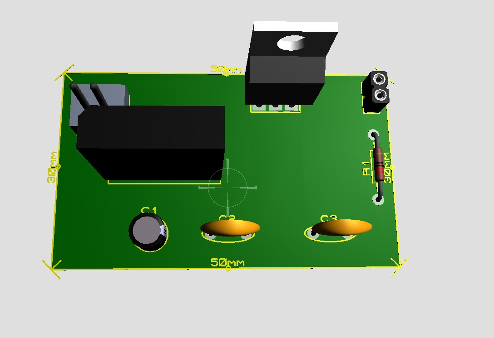
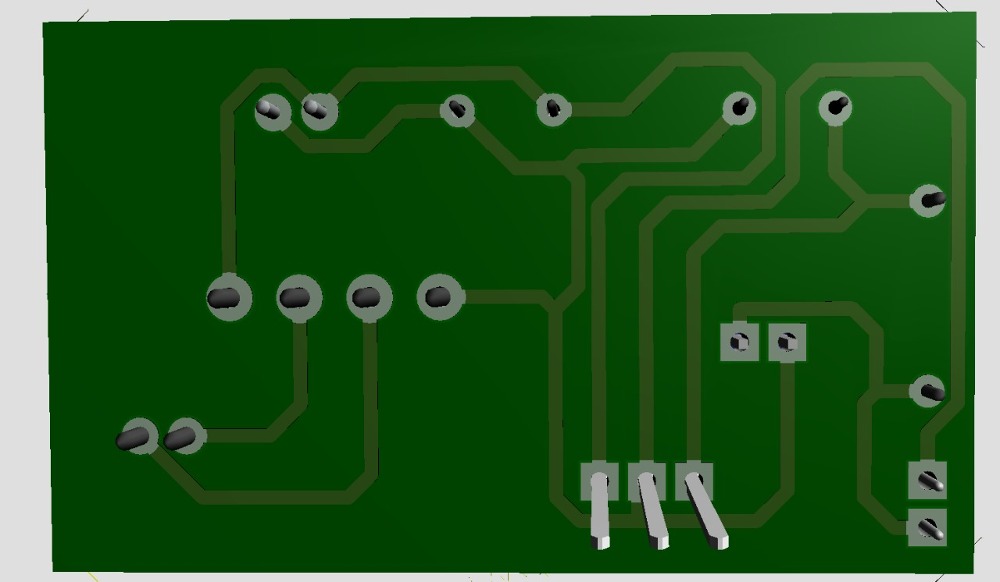

# Modelo 3D do Retificador de onda

#### 🖼️ Imagem de cima

#### 🖼️ Imagem de baixo

  

- Este modelo 3D é uma representação visual de uma placa de circuito impresso com componentes eletrônicos referente um retificador de onda

