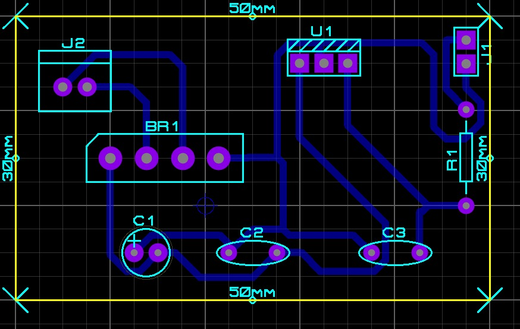

# Modelo pcb do Retificador de onda

### 📏 Dimensões e Design
- Tamanho da PCB: 50mm x 30mm.

- Trilhas bem distribuídas para minimizar interferências e melhorar a dissipação de calor.

- Furos e Pads bem posicionados para facilitar a soldagem dos componentes.

