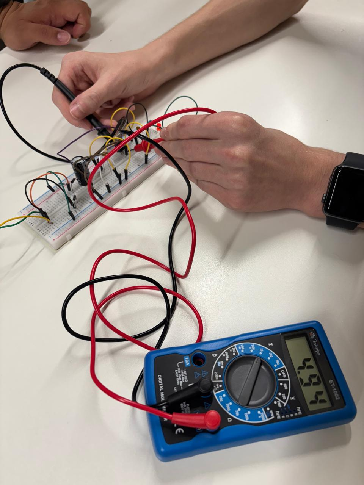
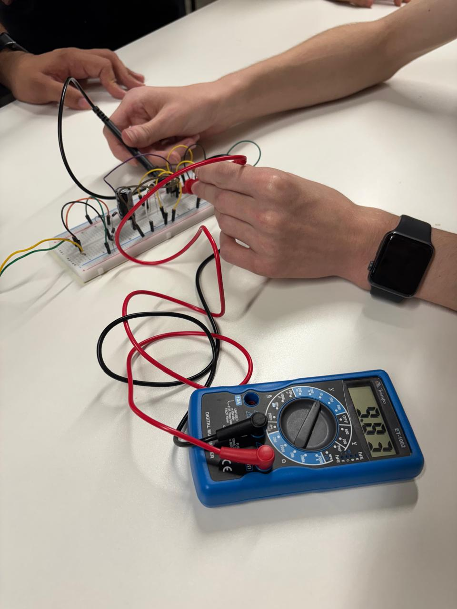

# Modelo pratica do Retificador de onda

### 🖼️ Imagem 1

##### Imagem superior do modelo pratico

- Montagem do Circuito: O retificador de onda foi montado na protoboard, seguindo o esquematico adequado.
- Conexão do Multímetro: O multímetro Minipa ET-1002 foi conectado aos pontos de interesse do circuito para realizar as medições.
- Medição da Corrente: (Se aplicável) A corrente no circuito também foi medida, utilizando a função apropriada do multímetro.
- Registro dos Dados: Os valores medidos foram registrados e serão apresentados a seguir.

### 🖼️ Imagem 2

##### Primeira medida registrada
- Tensão de Saída: A tensão de saída medida foi de 4.94V. Este valor representa a tensão retificada obtida do circuito.
- Forma de Onda: (Se aplicável) A forma de onda da tensão de saída pode ser visualizada utilizando um osciloscópio, se disponível. Isso forneceria informações adicionais sobre o comportamento do retificador.
- Eficiência do Retificador: A eficiência do retificador pode ser calculada comparando a tensão de saída com a tensão de entrada.
- Ripple: (Se aplicável) O ripple na tensão de saída pode ser medido e analisado para avaliar a qualidade da retificação.

### 🖼️ Imagem 3

##### Ultima imagem registrada
- A imagem mostra uma medição de 9.83V em um multímetro digital (Minipa ET-1002) durante a análise de um circuito retificador de onda. No entanto, o valor esperado para essa medição seria próximo de 12V. Essa discrepância levanta algumas questões e possíveis explicações como:
    1. Queda/ocilação de Tensão.

